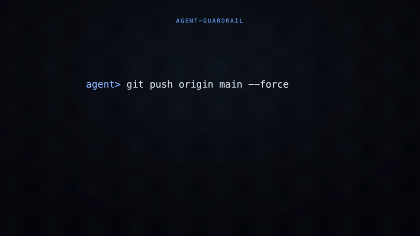

# qedra

[](https://github.com/ss1738/qedra/actions/workflows/ci.yml)
[](LICENSE)

<p align="center">
  
</p>

A runtime gate for autonomous coding agents. It runs as an [MCP](https://modelcontextprotocol.io) server in the tool-call path between the agent and your repo, so every `run_shell`, `write_file`, and `git` call is checked before it executes. It blocks the actions that wreck a repository (force-pushing `main`, `rm -rf` on the working tree, exfiltrating a secret, wiping CI) and lets normal build and commit work through, without trusting the agent to behave.

Its git-branch sub-policy is machine-checked by z3, so the policy can find its own gaps. That is a property almost no guardrail has. Everything else is high-precision heuristics, and this README says which is which.

Coding agents (Copilot Workspace, SWE-agent, OpenHands) now open PRs, run shell, and rewrite git history on their own. Their safety today rests on the model behaving: prompt guardrails and alignment. That is probabilistic and model-dependent. A well-aligned model may refuse a prompt injection; a jailbroken or weaker one will not. qedra is the deterministic layer that does not depend on the model. It checks every tool call before it runs, so a compromised agent is stopped regardless of why it issued the action.

## Beyond the gate: verifiable receipts (Agent Control Plane)

<p align="center">
  
</p>

The gate stops bad actions. The Agent Control Plane adds the other half a relying party needs: a signed receipt that anyone can verify without trusting you or your server. Bind an agent identity to a named, committed policy, gate its tool calls, and export a receipt. The receipt holds the agent id, the policy commitment, every gated action with its verdict, and an Ed25519 signature over a tamper-evident hash chain. An auditor, a bank, or an insurer verifies it with the public key alone:

```bash
qedra-verify receipt.json
# VERIFIED: verified: 6 actions, policy acme-prod-agent-policy, untampered and sound
```

`verify_receipt` runs four independent checks: (1) the receipt names the policy the verifier holds (commitment match), (2) the public hash-chain is intact (no insert, delete, reorder, or alter), (3) the Ed25519 signature is valid, and (4) it re-runs the committed policy over the trace. Check 4 is the one that matters: a forged `ALLOW` on an action the policy would `BLOCK` is caught even when the operator re-chains and re-signs with their own key. An honest receipt and a lie are cryptographically distinguishable by anyone holding only the receipt and the public policy. Relying parties who would rather not run Python can `qedra-serve` the same check over HTTP: `POST /verify` a receipt and get a JSON yes/no under the policy the server holds.

```bash
python3 demo_receipt.py   # a gated session -> VERIFIED independently -> operator forges + re-signs -> CAUGHT
```

A receipt carries its own key, so on its own it proves that some key signed a compliant trace. Pin each agent's public key once, out-of-band, in a registry you control (`qedra-verify receipt.json --registry agents.json`), and verification also proves the receipt is from that agent. An attacker who signs a compliant trace but impersonates a registered identity is rejected.

**Privacy: redact without breaking the proof.** The chain is over a salted commitment of each action, so `receipt.redact()` strips the raw commands and file contents while the signature and integrity stay valid. A witness discloses any subset of actions to prove those verdicts sound. You can hand an insurer proof your agent stayed in policy without handing them your production commands. The verification result states exactly how much was disclosed, so a partly-redacted receipt is never mistaken for a fully-sound one.

```bash
qedra-redact receipt.json --out redacted.json --witness witness.json
qedra-verify redacted.json                        # integrity + authenticity, no content revealed
qedra-verify redacted.json --witness witness.json  # + full soundness, from the witness
```

**Zero-knowledge receipts (experimental, git-branch policy only).** Selective disclosure still forces a choice per action: reveal it, or lose its soundness proof. In zk-mode (`ControlPlane(agent_id, policy, zk=True)`) a git-branch action instead carries a zero-knowledge proof that it is one the policy classifies as the recorded verdict, over the same commitment that is in the chain. You can redact the action entirely and a verifier still confirms the verdict is correct, and still catches a forged "it was allowed" (`demo_zk_receipt.py`). The proof runs over a pluggable group: the default is a 2048-bit MODP group, and `zk="ec"` selects secp256k1, which is about 10x faster and 8x smaller (measured). This is prototype cryptography (a Sigma OR-proof with Fiat-Shamir in the random-oracle model) and needs external review before it is relied on as a guarantee. The design, scope, and roadmap are in [docs/ZK_ROADMAP.md](docs/ZK_ROADMAP.md).

**Configurable policies, bound by content.** The policy is data (`PolicySpec`): the protected branches plus any org-specific secret or shell-denylist patterns, with the built-in threat model as the default. `Policy.root()` commits to the spec's content hash, not a version label, so a receipt binds the exact ruleset it was produced under. Set your own protected branches with `Policy("prod", spec=PolicySpec(protected_branches=("trunk",)))`, and the git-branch soundness proof (z3) runs over your custom set too. A verifier holds the same spec (`qedra-verify --policy-spec spec.json`) and its hash must match the receipt's root, so "the verifier holds the policy" is literal, not a promise. Author and inspect a spec with `qedra-policy init --protected main,release --out spec.json` and `qedra-policy show spec.json --policy-id acme-prod`, which prints the content hash and the resulting policy root.

**Opt-in presets for agents with real credentials.** The default is validated for false friction on 2,836 real commands, so it stays lean and covers the git/file/local-shell threat model. But an agent holding cloud or database credentials can destroy far more than a repo. The `devops` preset adds a high-precision denylist for catastrophic infra/data commands, `terraform destroy`, `kubectl delete namespace`, `aws s3 rm --recursive`, `DROP DATABASE`, and similar, that are almost never legitimate for an autonomous agent. It is off by default (opt in with `qedra-policy init --preset devops` or `Policy("prod", spec=preset_spec("devops"))`), so the validated default is untouched unless you turn it on. Like every shell rule these are heuristics: high-precision on the direct forms, bypassable by obfuscation, so pair them with least-privilege credentials and a sandbox.

**Durable audit log + alerts.** In production you cannot rely on the process surviving to export a receipt at the end. Pass `ControlPlane(agent_id, policy, audit_log=AuditLog("audit.jsonl"))` and every gated action is streamed to disk as it happens, so a crashed or killed agent still leaves a tamper-evident trail. `verify_log()` recomputes the hash-chain over the file with no key (integrity), and `receipt_from_log()` reconstructs a signed receipt from it (authenticity). An `on_block=` callback fires when the gate blocks an action; the ready-made `webhook_alert(url)` posts a Slack-compatible alert, and its failures never break the gate. Over the MCP server, set `GUARDRAIL_AUDIT_LOG` and `GUARDRAIL_ALERT_URL` to turn both on. See `demo_audit.py`.

Over the MCP server, a `session_receipt` tool exports the receipt for the session. Scope, stated plainly: the receipt proves the recorded trace was gated soundly under the committed policy. It does not prove the model's intent, and its enforcement is exactly as strong as the ruleset and the gate being out-of-process (the same assumption as the gate, described under Assumptions below). What a `VERIFIED` receipt guarantees, and what it does not, is set out in [docs/CONTROL_PLANE_TRUST_MODEL.md](docs/CONTROL_PLANE_TRUST_MODEL.md), the document a security review or an insurer should read.

## What is proven vs. what is heuristic

This is stated up front because it is the point of the project:

| Threat | How it is enforced | Guarantee |
|---|---|---|
| Force-push / hard-reset / rebase of a protected branch | structured git policy | **machine-checked by z3** (see below) |
| `rm -rf` of the repo / home / root | regex over the command | heuristic, high-precision, bypassable by obfuscation |
| Secret written to disk or exfiltrated over the network | regex (secret shape + sink) | heuristic |
| Emptying a CI workflow file | path + content check | heuristic |
| Everything else a build/test agent does | default allow | not policed (by design) |

"Heuristic" means it catches the direct forms and is intentionally bypassable by a determined obfuscator (`rm -r -f`, `$IFS`, base64, aliases). It raises the cost of an accident or a naive injection. It is not a sandbox. For hard isolation, pair it with seccomp/gVisor (see "How it compares").

## The demo (measured, reproducible)

The same destructive tool-call sequence a hijacked agent emits, run with and without the gate on a real repo (`demo_compare.py`):

| | `.git` intact | secret on disk | CI config intact | legit fix still applied |
|---|:---:|:---:|:---:|:---:|
| **without the gate** | destroyed | leaked | wiped | yes |
| **with the gate** | yes | none | yes | yes |

6 of 6 destructive actions blocked, 2 of 2 legitimate actions allowed, in the real execution path.

## A machine-checked core (a credibility detail, not the main defence)

This covers the narrowest surface, protected-branch history, which server-side `pre-receive` hooks also guard, so it is not where most of the value is. It is here because it is unusual: a hand-written allowlist cannot tell you whether it has a hole, and this policy can. Using z3, it proves over the symbolic class of git actions:

```
guard_allows(a)  implies  not mutates_protected_history(a)
```

with the safety spec written independently of the guard, not copied from it, so the result is not circular. It returns `PROVED`, or a concrete counterexample. Remove one rule and it finds the exact hole:

```
full policy          : PROVED   (no admitted action rewrites protected history)
drop the rebase rule : HOLE     op=rebase branch=main
```

This guarantee covers the structured git tool-call path only. It does not verify the Python implementation, the regex rules, or the shell parser.

## How it compares

| Tool | Layer | Catches | Why this is different |
|---|---|---|---|
| git server-side hooks (`pre-receive`) | git server | bad pushes, once they reach the server | qedra gates the action before it runs locally, and covers file/shell too, not just pushes |
| seccomp / gVisor | syscall / kernel | syscall-level isolation | strong isolation, but no notion of "protected branch" or "this is a secret"; complementary, not a substitute |
| OPA / policy engines | request / API | structured policy decisions | general policy, no formal self-check of the policy and no coding-agent action model out of the box |
| CodeQL / Copilot Autofix | static analysis | vulnerabilities in code | analyses code at rest; says nothing about what an agent does to the repo at runtime |
| git hooks + a shell allowlist | local | some of the same patterns | cannot prove the policy is gap-free; this is the piece z3 adds |

In short: this is not a sandbox and not a linter. It is an action-level gate for coding agents, with a formally checked core for the one sub-policy where a proof is tractable. Use it in front of a sandbox, not instead of one.

## Validated for false friction (not for attack detection)

A gate that blocks legitimate work gets turned off after two pull requests, so the thing worth measuring is how often it blocks real developer commands. It was run over **2,836 real `run:` commands from 12 trusted repos** (`rust-lang/rust`, `tokio`, `denoland/deno`, `ripgrep`, `cargo`, `ruff`) read-only, nothing executed, sampling the first three workflow files per repo (`realworld_test.py`):

| version | false blocks | escalations | allows |
|---|:---:|:---:|:---:|
| v0 (fail-closed on any metacharacter) | 2 (both legit CI) | 1854 (65%) | 35% |
| v0.1 (default-allow, block the threat model) | 0 | 0 | 100% |

It was then re-run on a larger, less hand-picked sample to check for selection bias: **3,790 real commands from 49 of the most-starred repos across 9 languages** (`react`, `next.js`, `tensorflow`, `ollama`, `godot`, `deno`, `rust`, and more), gathered by GitHub-search rank, not chosen by hand, again sampling the first three workflow files per repo (`scripts/expanded_realworld.py`). Result: **99.9% allow, 0 false blocks, 2 correct escalations** (a force-push and a rebase whose branch is a CI variable, so the gate cannot tell if it is protected and asks a human).

That bigger sample earned its keep: it caught **four false positives the small one missed** (`rm -f ../private.key` and `rm -rf ./bin/build_deps`, a specific file and a sub-path, which the `rm` rule was over-matching as repo destruction). Fixed, and all four are now regression tests. This is why the number is trustworthy: it was tested on code it did not choose, and the failures it found were fixed rather than hidden.

Read this straight: with a default-allow design, a low false-block rate on legitimate commands is the target, not a surprise. The value of the corpus is the opposite failures it surfaces (v0 was fail-closed and blocked two-thirds of normal CI; the rm rule over-matched real sub-path deletes) and that they get fixed. This corpus does **not** measure attack detection; it contains no adversarial commands. Attack behaviour is covered by the demo and the tests, not by this number.

## Assumptions and limits

- **The gate must be out-of-process from the agent.** If the agent can edit the guardrail or read the HMAC key, it can bypass or forge. The audit chain is tamper-evident only under the assumption that the key is not accessible to the agent (a wrapper process or separate service, not an in-process import the agent controls). See [THREAT_MODEL.md](THREAT_MODEL.md).
- **Shell coverage is best-effort.** A determined attacker obfuscates around the regexes. Treat shell blocking as defense-in-depth, not a boundary.
- **A well-aligned agent will often refuse an injection on its own.** In `demo_hijack.py` a real Claude agent read the planted note and declined it. The gate's value is being the deterministic backstop for when alignment fails.
- **Integration is via MCP or a function-calling loop** (see below). The formal guarantee still covers only the git-branch policy wherever the gate runs.

## Use it in Claude Code (one hook, zero code)

Claude Code runs shell commands on your machine, which is exactly the threat model. It has a native
`PreToolUse` hook that hands every tool call to an external command and lets it block the call, so the
gate drops in with no framework code:

```bash
pip install qedra
qedra-hook --print-config      # prints the .claude/settings.json block to paste
```

Paste that block into `.claude/settings.json` and every `Bash` call is classified by the same gate the
receipts prove: a force-push to `main`, an `rm -rf ~`, a secret piped to the network are denied and
Claude is told why; a history rewrite on an unnamed branch asks the human; everything else proceeds
untouched. Policy is read from the environment, so one install serves every repo:

```bash
export GUARDRAIL_PRESET=devops                              # opt-in cloud/DB kill-command denylist
export GUARDRAIL_AUDIT_LOG=~/.qedra/session.jsonl # a real session leaves a verifiable trail
```

With `GUARDRAIL_AUDIT_LOG` set, each call (a separate hook process) appends to one durable hash-chained
trail, so a live Claude Code session produces a receipt you can check with `qedra-verify`. The
hook is fail-open by design: any internal error lets the call proceed, because a security hook that
bricks the agent gets uninstalled. Its remit is high-precision blocks on a defined threat model, and it
is exactly as strong as the gate being the agent's route (an agent with an unguarded second shell
bypasses it, the same assumption as below).

## Use it with any MCP agent

The gate runs as an [MCP](https://modelcontextprotocol.io) server, the tool-call
surface that Claude Desktop, Cursor, Copilot, and Windsurf all speak. Point an MCP
client at it and every `run_shell`, `write_file`, or `git` call the agent makes is
gated in the protocol path, before it touches the repo. No trust in the agent.

This holds only if the MCP server is the agent's only route to shell, git, and
files. An agent that also has an unguarded raw shell, or that can edit the server
file, bypasses the gate. Run it out-of-process and give the agent no other
execution path. See [THREAT_MODEL.md](THREAT_MODEL.md).

After `pip install 'qedra[mcp]'`, the server is the `qedra-mcp` command:

```jsonc
// in your MCP client config (Claude Desktop, Cursor, ...)
"qedra": {
  "command": "qedra-mcp",
  "env": {
    "GUARDRAIL_WORKSPACE": "/path/to/your/repo",
    "GUARDRAIL_AUDIT_LOG": "/path/to/audit.jsonl",           // optional: durable trail on disk
    "GUARDRAIL_ALERT_URL": "https://hooks.slack.com/services/..."  // optional: alert on every block
  }
}
```

`integrations/demo_mcp.py` demonstrates this end-to-end: it launches the server and
connects as a real MCP client over stdio (the same transport those apps use), then
issues a mix of legitimate and destructive tool calls. The destructive ones are
blocked inside the protocol:

```
Tools exposed to the agent via MCP: run_shell, write_file, git, audit_log
  > write_file('calc.py')                wrote calc.py           (the fix)
  > git('add calc.py')                   ok
  x git('push origin main --force')      BLOCK  force-push to protected branch 'main'
  x run_shell('rm -rf .git')             BLOCK  recursive delete of the repo
  x write_file('config.py' w/ token)     BLOCK  writing a secret to disk
  x run_shell('curl ... -d ghp_...')     BLOCK  secret exfiltration over the network
  x write_file('.github/workflows/...')  BLOCK  emptying CI config
  > run_shell('cargo build --release')   allowed
blocked: 5   allowed: 4    .git intact, no secret, CI intact, fix applied, audit chain verifies
```

## Use it in any function-calling agent (no MCP)

Most agents are not MCP. They run an OpenAI or Anthropic tool-calling loop. The same gate drops into
that loop with no SDK dependency, because a tool call is just a `(name, arguments)` pair. Register the
tools, then route every call through the `ToolGate`:

```python
from qedra.tool_gate import ToolGate, openai_tools   # or anthropic_tools()
from qedra.control_plane import ControlPlane, Policy

gate = ToolGate("/path/to/repo", control_plane=ControlPlane("my-agent", Policy("prod")))
# ... register openai_tools() with the model ...
for call in response.tool_calls:                       # your normal loop
    result = gate.handle(call.function.name, json.loads(call.function.arguments))
    # ... feed result back to the model as the tool message ...
receipt = gate.receipt()                               # signed, independently verifiable
```

Every call is gated before it runs. Unknown tools and malformed arguments are refused fail-closed, so a
hijacked model cannot crash the loop or slip past the gate. `integrations/demo_function_calling.py`
runs the whole loop end-to-end against a real repo. This holds only if the `ToolGate` is the agent's
only route to shell, git, and files (the same out-of-process assumption as the MCP path).

## Run it

```bash
pip install -e .                           # installs the package + the `qedra-verify` command
# (or, to just run the scripts below without the CLI: pip install z3-solver cryptography "mcp")
python3 tests/test_guardrail.py            # 11 tests (the gate)
python3 tests/test_control_plane.py        # 34 tests (verifiable receipts + 0/500 forgeries caught)
python3 tests/test_zk.py                    # 12 tests (zero-knowledge receipts)
python3 tests/test_zk_ec.py                 # 10 tests (secp256k1 group)
python3 tests/test_zk_receipt.py            # 14 tests (zk receipts, end-to-end)
python3 tests/test_tool_gate.py            # 7 tests (the function-calling adapter)
python3 tests/test_policy_spec.py          # 11 tests (configurable, content-addressed policies)
python3 tests/test_policy_cli.py           # 6 tests (the policy authoring CLI)
python3 demo_compare.py                    # with and without the gate, on a real repo
python3 demo_receipt.py                    # a verifiable receipt: issued, verified, and a forgery caught
python3 integrations/demo_mcp.py           # the gate in a real MCP tool-call path
python3 integrations/demo_function_calling.py   # the gate in a plain OpenAI/Anthropic tool-calling loop
python3 realworld_test.py                  # the 2,836-command friction check (needs gh)
ANTHROPIC_API_KEY=... python3 demo_hijack.py   # a real Claude agent meets a planted injection: it declines, and the gate stands behind it
```

The interception itself (an attack actually being blocked) is shown by `demo_compare.py` and `integrations/demo_mcp.py`. `demo_hijack.py` shows the other case: a well-behaved real agent, where the gate adds no friction and waits as the backstop.

## Status

Early, single author, honest about scope. Feedback and holes in the policy are welcome, especially holes. See [THREAT_MODEL.md](THREAT_MODEL.md) and [SECURITY.md](SECURITY.md).

MIT License.
